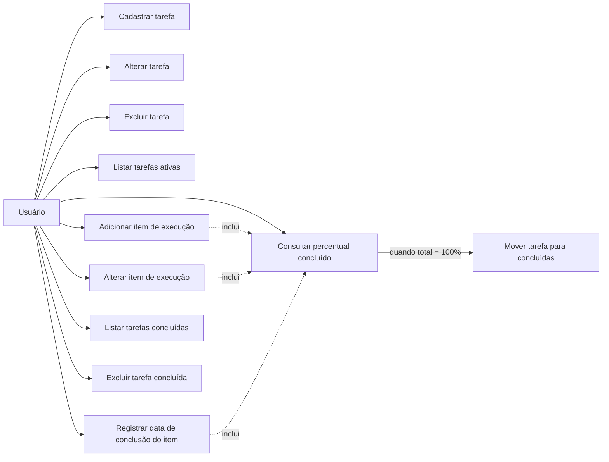
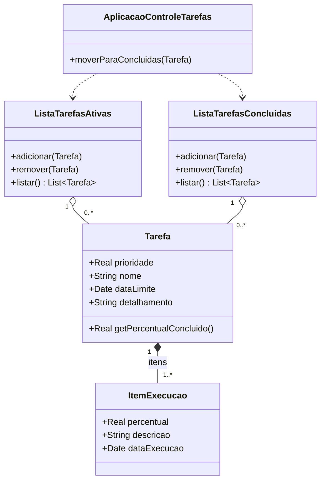
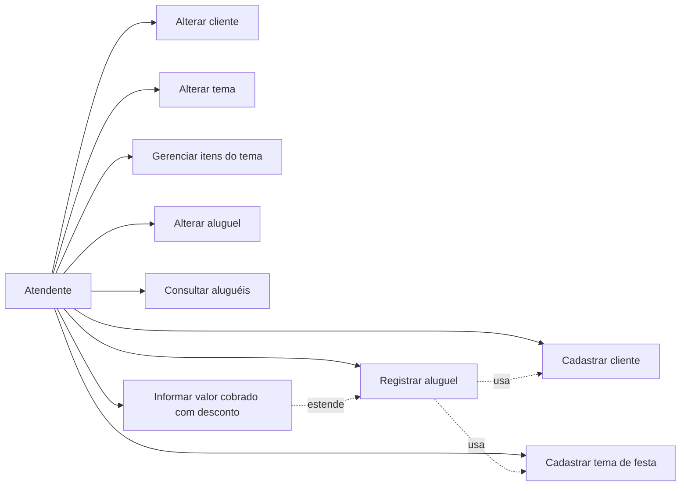
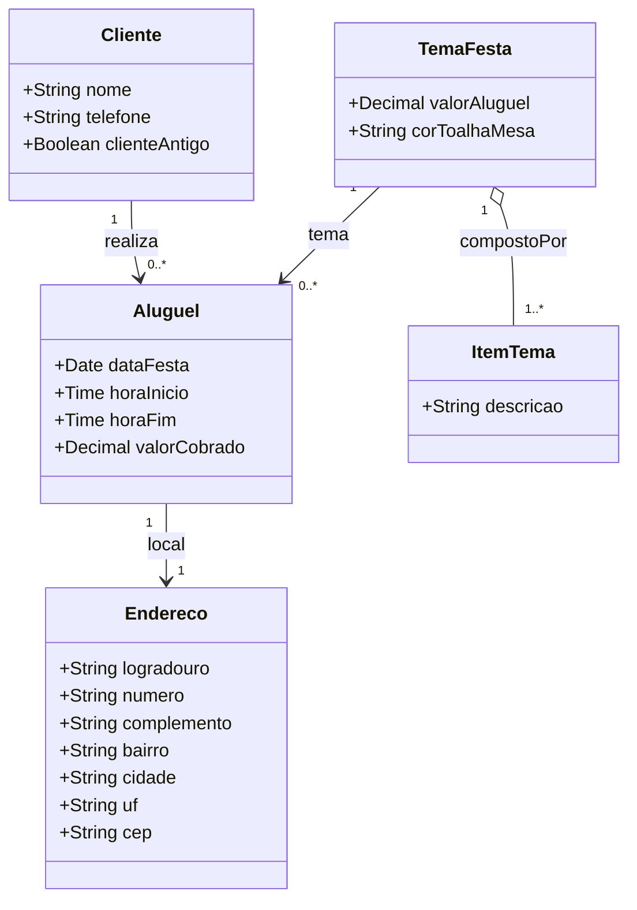
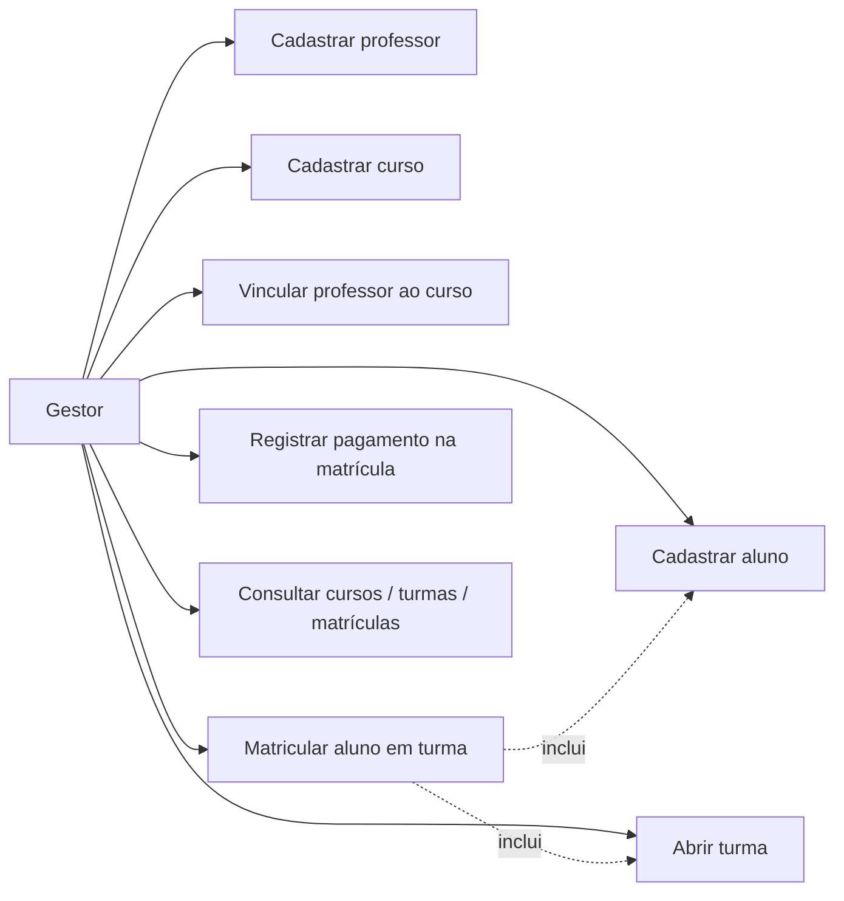
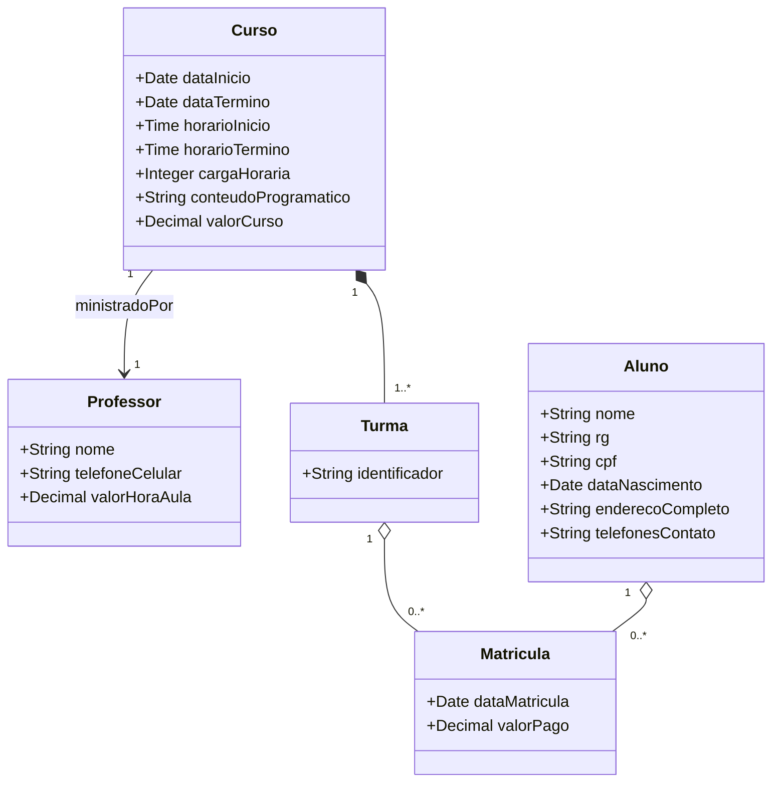

# Laboratório 02 — Modelos UML (casos de uso e classes)

Documento com diagramas em **Mermaid**. 
[mermaid.live](https://mermaid.live) ou usar extensões do VS Code/Cursor para exportar PNG/PDF.

---

## Exercício 01 — Controle de tarefas

### Casos de uso

**Ator:** Usuário.

**Resumo dos casos de uso**

| Caso de uso | Descrição breve |
|-------------|-----------------|
| Cadastrar / alterar / excluir tarefa | Prioridade (real), nome, data limite (se houver), detalhamento. |
| Gerenciar itens de execução | Percentual, descrição, data da execução (quando concluído). |
| Atualizar conclusão | Recalcular percentual; ao atingir 100%, mover para lista de concluídas. |
| Listar ativas / concluídas; excluir concluída | Conforme especificação do laboratório. |

### Diagrama de classes

---

## Exercício 02 — Festas infantis

### Casos de uso

**Ator:** Atendente (Rafaela / funcionário).

### Diagrama de classes

---

## Exercício 03 — Cursos de aperfeiçoamento

### Casos de uso

**Ator:** Dono da empresa.

### Diagrama de classes

---